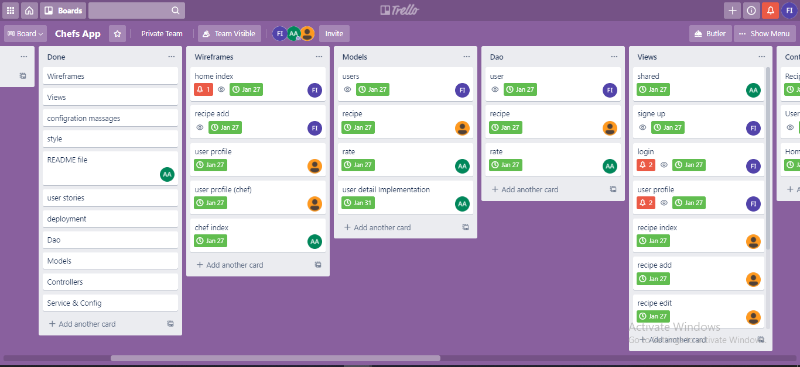
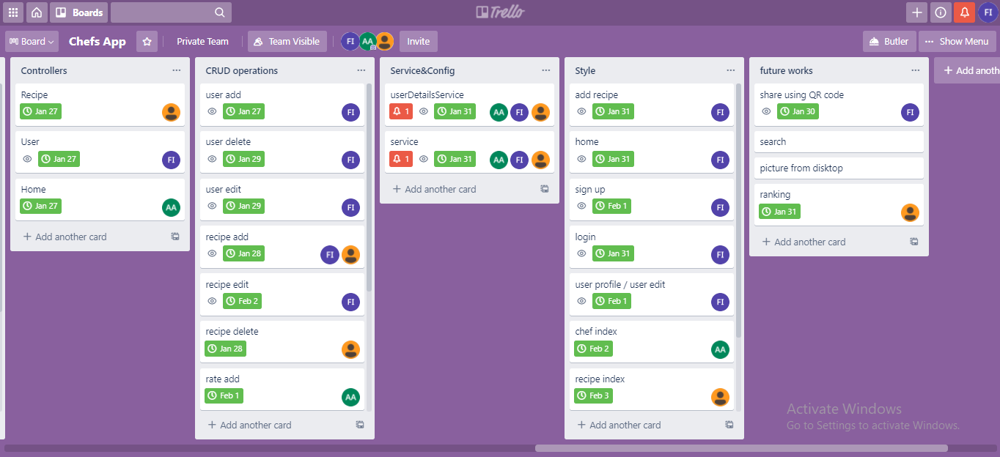
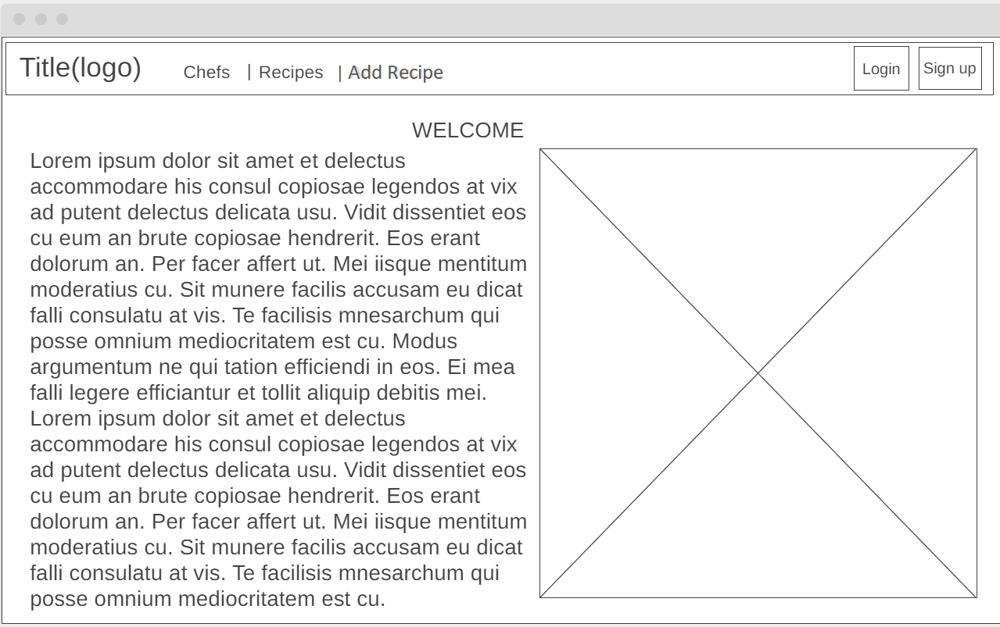
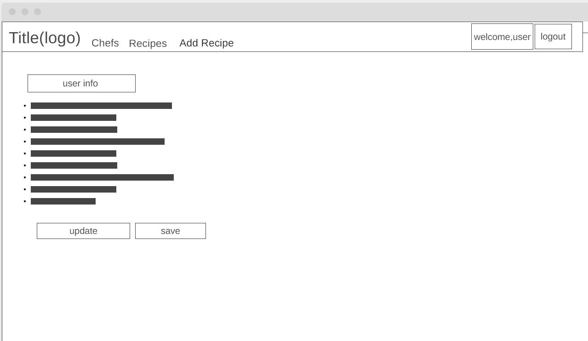
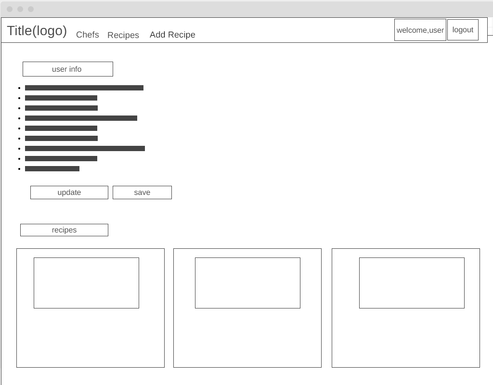
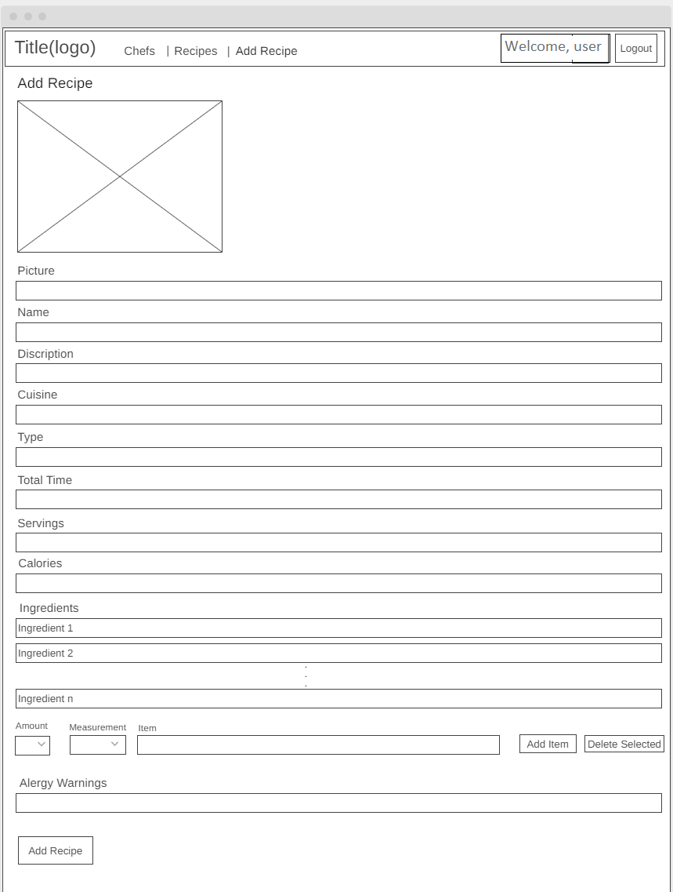
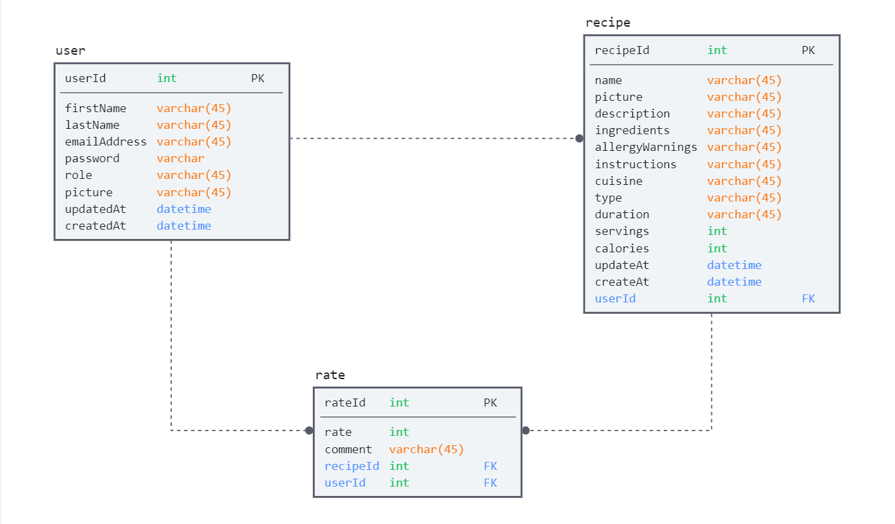

# Chefs App
## Introduction
Chefs app is a website that manages the recipes ...
## Technologies used:
* HTML, CSS, Javascript and JQuery
* Spring io
* SQL
* Trello
* Wireframe.cc
* GitHub & GitBash
* Bootstrap 
## General approach:
Planning for the project using Trello, devide the tasks , adding deadlines and help each other when someone face a problem. 
## Unsolved problems or major hurdles you had to overcome:
none
## Planning documentation:
We used Trello website as a tool to devide and manage the project's tasks between us.

## Installation instructions for any dependencies:
No instructions  
## Wireframes:

## User stories:

1. As a user, I want to be able to create an account so that I can log in and add and rate recipes.
1. As a user, I want to be able to login into my account so that I can add and rate recipes.
1. As a user, I want to be able to edit my information, so I can change my information whenever I want.
1. As a user, I want to view my details, so I can view my recipes and general information.
1. As a user, I want to be able to view all available recipes, so I can choose what to cook from them.
1. As a user, I want to be able to filter the recipes, so I can find what I want quickly.
1. As a user, I want to be able to view the recipe's details, so I can know how to prepare it.
1. As a user, I want to be able to rate the recipe, so I can tell the world what I thought about it.
1. As a user, I want to be able to download QRCode that contains recipe or chef link, so that I can share them with my friends and family
1. As a chef, I want to be able to add recipes so that I can share my recipe with the world.
1. As a chef, I want to edit my recipe so that I can correct any mistakes  I find.
1. As a chef, I want to delete my recipe so that I can remove any recipe I don't want to share anymore.
1. As a chef, I want to view all my recipes in my profile, so I can access them whenever I want.
1. As an Admin, I want to be able to delete any user, so that I can delete any user that violates rules.
1. As an Admin, I want to be able to delete any recipe, so that I can delete any recipe with an extremely low rating.
## Database design

## Future work
* Search funtionality 
* Filter recipe by other properties
* Allow user to upload images from personal device 
* Share recipe through social media 
## Credits:
Download image:
* https://www.youtube.com/watch?v=rd6m-6l2xQQ
* https://stackoverflow.com/questions/31448193/save-to-desktop-without-the-exact-path

Generate QRCode:
* http://learningprogramming.net/java/spring-mvc/qrcode-in-spring-mvc-framework-and-spring-data-jpa/

